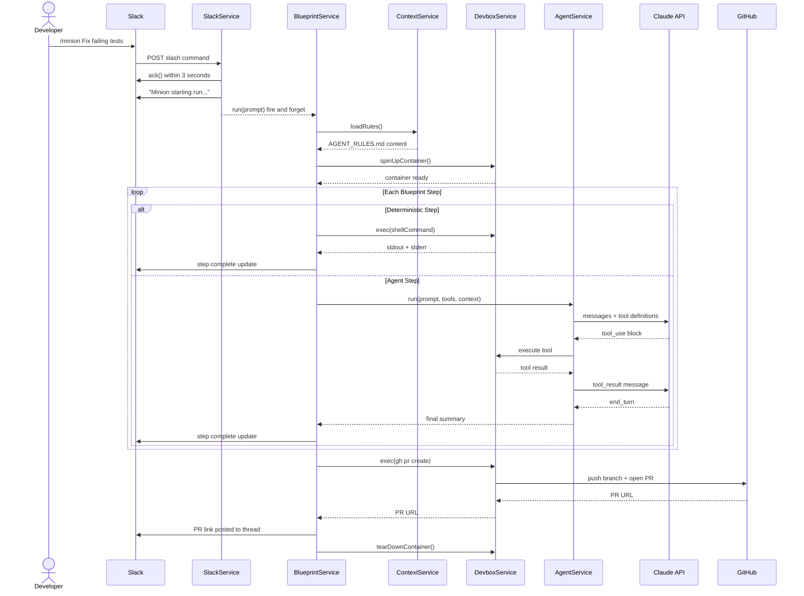
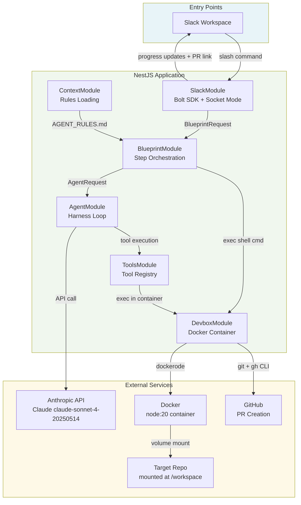
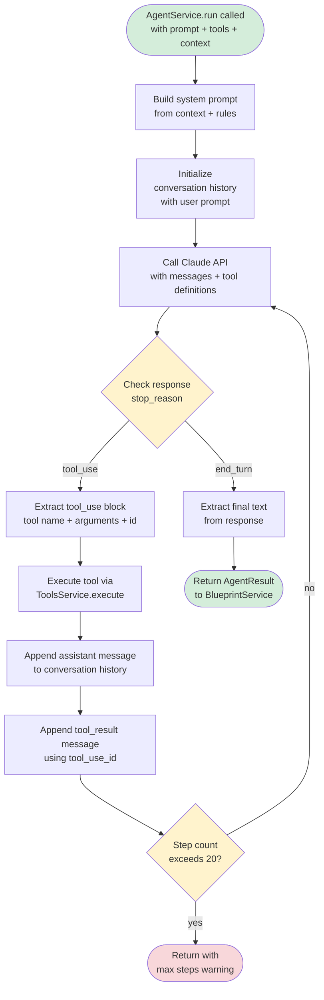

# Minion

A personal agentic coding assistant inspired by [Stripe's Minions system](https://stripe.dev/blog/minions-stripes-one-shot-end-to-end-coding-agents). Triggered via a Slack slash command, runs fully autonomously inside an isolated Docker container, and opens a GitHub PR when done. No human interaction during the run.

> Type `/minion Fix the failing tests in the user service` in Slack. Get back a PR link.

---

## How It Works

A single slash command kicks off a fully autonomous run. The agent reads the codebase, implements the task, runs the validation loop, self-corrects on failures, and opens a pull request -- all without human interaction.



---

## Architecture

Seven distinct modules with clean boundaries. Each maps directly to a component of the agentic system.



---

## Agent Loop

The core of the system. A stateless while loop that calls Claude, executes tool calls, feeds results back, and repeats until the task is done or the step limit is reached.



---

## Blueprint Engine

The blueprint engine is the core design insight of this system. Inspired by Stripe's Minions architecture, it separates deterministic steps (shell commands that always behave the same way) from agent steps (LLM calls that handle ambiguity). This combination outperforms either approach alone.

| Step | Type | Description |
|------|------|-------------|
| Implement task | Agent | Reads codebase, writes the solution |
| Format code | Deterministic | Runs Prettier |
| Fix lint errors | Agent | Runs ESLint, self-corrects |
| Type check | Deterministic | Runs tsc --noEmit |
| Fix type errors | Agent | Self-corrects on type failures |
| Run tests | Deterministic | Runs full test suite |
| Fix test failures | Agent | Self-corrects on test failures (3 rounds) |
| Commit changes | Deterministic | git add + commit |
| Open PR | Deterministic | gh pr create |

---

## Stack

| Layer | Technology |
|-------|-----------|
| Framework | NestJS 10 + TypeScript |
| Entry point | Slack Bolt SDK (Socket Mode) |
| LLM | Anthropic Claude API (claude-sonnet-4-20250514) |
| Agent sandbox | Docker (node:20 container) |
| PR creation | GitHub CLI (gh) |
| Config | @nestjs/config + dotenv |

---

## Design Decisions

**Why NestJS over Express**
The system has naturally distinct concerns that map cleanly to NestJS modules -- Slack, agent harness, blueprint engine, tools, devbox, context. NestJS's dependency injection makes each module independently testable and the boundaries explicit.

**Why Docker over git worktrees**
Docker provides true isolation -- the agent runs in an environment identical to a clean developer machine, with no access to the host system, no shared state between runs, and no risk of destructive commands affecting the host. Git worktrees fall apart at scale and don't provide the same isolation guarantees.

**Why Socket Mode over webhooks**
Socket Mode requires no public URL, no ngrok, no deployed server during development. The bot connects outbound to Slack's servers over a WebSocket. Zero infrastructure to receive messages.

**Why the blueprint engine separates deterministic and agent steps**
Adding an LLM to steps like formatting, type checking, or committing makes the system more brittle and more expensive. Those steps have deterministic correct outputs -- a shell command is faster, cheaper, and 100% reliable for them. LLM reasoning is reserved for steps that genuinely require understanding code.

**Why 3 CI rounds instead of Stripe's 2**
At Stripe's scale, limiting CI rounds is a cost constraint. At this scale, allowing 3 rounds gives the agent more chances to self-correct and generates better signal about where the agent gets stuck.

---

## Project Structure

```
src/
  slack/           Bolt app, slash command handler, thread management
  agent/           Core harness loop, Anthropic SDK integration
  blueprint/       Step orchestration, default coding task blueprint
  tools/           Tool registry, 5 tool implementations
  devbox/          Docker container lifecycle, exec, git + gh setup
  context/         AGENT_RULES.md loading and system prompt injection
  app.module.ts
  main.ts
```

---

## Setup

### Prerequisites
- Node.js 20+
- Docker Desktop (running)
- GitHub CLI (`gh`) installed and authenticated
- A Slack workspace where you can create apps

### Environment Variables
Create a `.env` file at the root:

```bash
SLACK_BOT_TOKEN=xoxb-...
SLACK_APP_TOKEN=xapp-...
ANTHROPIC_API_KEY=sk-ant-...
GITHUB_TOKEN=github_pat_...
TARGET_REPO_PATH=/absolute/path/to/target/repo
GIT_USER_NAME=your-github-username
GIT_USER_EMAIL=your-github-email
```

### Slack App Configuration
1. Create a new app at [api.slack.com/apps](https://api.slack.com/apps)
2. Enable Socket Mode -- generates `SLACK_APP_TOKEN`
3. Add slash command `/minion` with description "Describe a coding task and get back a PR"
4. Add bot token scopes: `commands`, `chat:write`, `chat:write.public`
5. Install to workspace -- generates `SLACK_BOT_TOKEN`

### Running

```bash
npm install
npm run start:dev
```

### Usage

In any Slack channel the bot is invited to:

```
/minion Fix the failing tests in the user service
/minion Add input validation to the createUser function
/minion Refactor the shell tool to handle multiline output
```

Minion will post progress updates to the thread and a PR link when done.

---

## Inspiration

- [Stripe's Minions -- Part 1](https://stripe.dev/blog/minions-stripes-one-shot-end-to-end-coding-agents)
- [Stripe's Minions -- Part 2](https://stripe.dev/blog/minions-stripes-one-shot-end-to-end-coding-agents-part-2)
